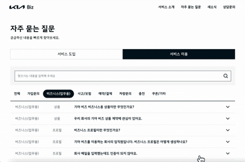
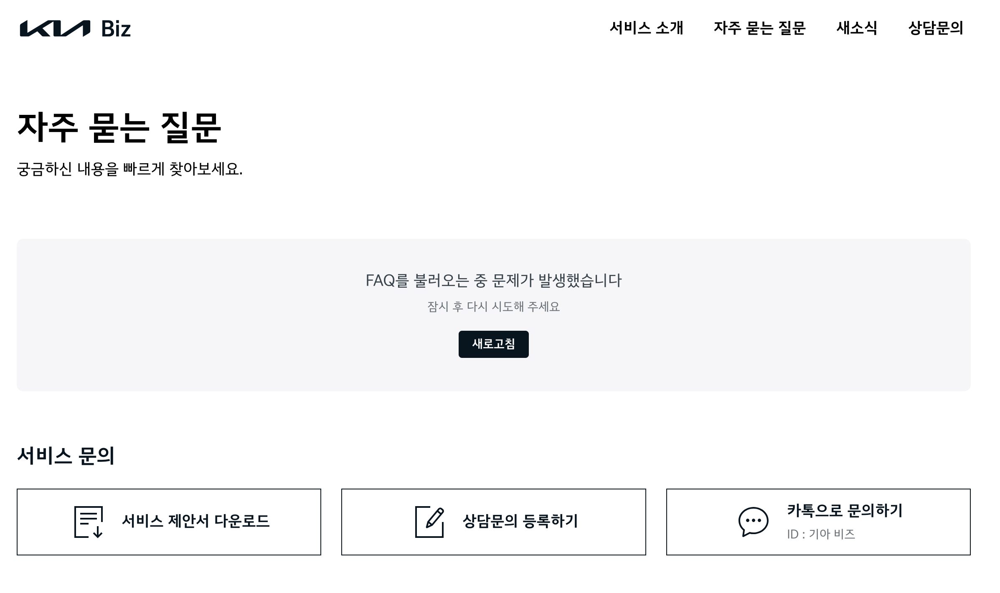

# 현대오토에버 지원자 권오연

기아 비즈 홈페이지 FAQ 구현

## 배포 링크

[사전과제 배포 링크 바로가기](https://fancy-gnome-b38a02.netlify.app/)



## 기술 스택

     


## 파일 구조

```
/src
  /api: API 요청 관련 코드
  /assets: 이미지, 아이콘 등 정적 파일
  /contexts: React Context API로 관리하는 전역 상태
  /features: 재사용 가능한 기능 단위 컴포넌트
  /hooks: Tanstack Query Hooks
  /mocks: MSW로 만든 mock 서버
  /pages: 라우트별 페이지 컴포넌트
  /shared: 공통으로 사용되는 컴포넌트, 훅, 유틸리티 함수
  /styles: 전역 스타일 관련 파일
```

## 구현 사항

### 1️⃣ 검색 기능 구현
- 검색어 입력 및 검색 실행 (버튼 클릭 또는 엔터키)
- 검색 결과 개수 표시
- 검색어 초기화 기능
- 검색 후 카테고리 필터 변경 시에도 해당 필터에서 검색어 적용

### 2️⃣ Tab 카테고리 필터링
- 서비스 도입/이용 탭에 따른 카테고리 구분
- 카테고리 선택 시 해당 카테고리의 FAQ만 표시
- 카테고리 변경 시 데이터 초기화 및 처음부터 로드

### 3️⃣ FAQ 아코디언 리스트 구현
- 질문 클릭 시 답변이 펼쳐지는 아코디언 UI 구현
- 답변 영역 열림/닫힘 애니메이션 적용
- cubic-bezier 애니메이션으로 자동차가 출발하는 듯한 느낌의 애니메이션 구현
- 화살표 아이콘 회전 애니메이션

### 4️⃣ 조회수 
- FAQ 항목 클릭 시 조회수 증가 API 호출

### 5️⃣ 반응형 디자인
- 모바일, 태블릿, 데스크탑, 큰 화면의 데스크탑 총 4단계 레이아웃 대응

## 자세한 PR 내용
- [MSW mock 서버 추가](https://github.com/oyeon-kwon/frontend-kwonohyeon-autoever/pull/1)
- [Header](https://github.com/oyeon-kwon/frontend-kwonohyeon-autoever/pull/2)
- [Footer](https://github.com/oyeon-kwon/frontend-kwonohyeon-autoever/pull/3)
- [검색, Tab](https://github.com/oyeon-kwon/frontend-kwonohyeon-autoever/pull/5)
- [FAQ 리스트](https://github.com/oyeon-kwon/frontend-kwonohyeon-autoever/pull/6)
- [서비스 문의 섹션](https://github.com/oyeon-kwon/frontend-kwonohyeon-autoever/pull/7)
- [이용 프로세스 안내](https://github.com/oyeon-kwon/frontend-kwonohyeon-autoever/pull/8)
- [앱 다운로드](https://github.com/oyeon-kwon/frontend-kwonohyeon-autoever/pull/9)

## 추가로 고려한 사항
- 에러 바운더리 적용
  

- Context API 활용 전역 상태 관리
  - UI 관련 변수 (스크롤 여부, Header 모바일 메뉴 상태 등) 스크롤 이벤트 리스너를 한 곳에서 관리해 성능 개선
  - FAQ 관련 변수 (parameter, 선택한 질문 등) 변수를 전역으로 관리해 props drilling 제거
- util 함수 제작으로 재사용성 향상
- 오픈그래프 이미지 및 설명 적용
- 절대 경로 사용으로 유지보수성 향상

## 고민했던 사항
- FOUT 현상 방지를 위해 pre-load 활용
- "더보기" 버튼으로 새로운 FAQ 데이터를 로드할 때 레이아웃 쉬프트를 방지하기 위해,
  - 로딩 컴포넌트를 새로 로드될 데이터 위치에 배치하고
  - React Query의 placeholderData 옵션을 활용해 이전에 로드했던 데이터를 그대로 유지한 채로 새로운 데이터를 요청함으로서 UI의 깜빡임이나 레이아웃 쉬프트 방지